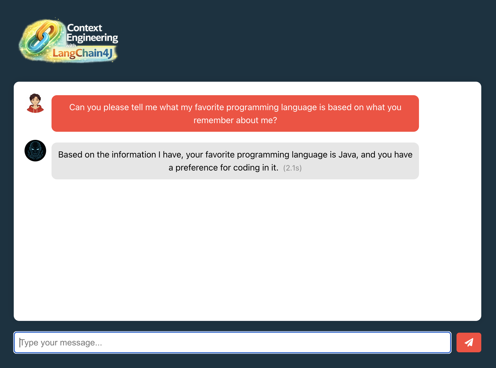
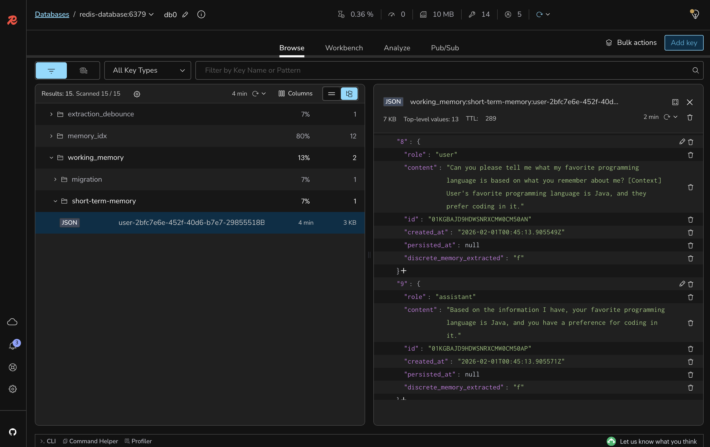

# Lab 6: Implementing Query Compression and Context Reranking

## 🎯 Learning Objectives

By the end of this lab, you will:
- Implement query compression to optimize retrieval queries
- Configure content reranking to prioritize relevant information
- Set up ONNX scoring models for semantic similarity
- Reduce context noise by filtering low-relevance content
- Test the impact of compression and reranking on response quality

#### 🕗 Estimated Time: 15 minutes

## 🏗️ What You're Building

In this lab, you'll optimize the RAG pipeline by adding query compression and content reranking, ensuring that only the most relevant information reaches the LLM. This includes:

- **Query Compression**: Simplifying queries while preserving intent
- **Content Reranking**: Scoring and ordering retrieved content by relevance
- **ONNX Scoring Model**: Using pre-trained models for similarity scoring
- **Context Optimization**: Filtering out low-scoring content

### Architecture Overview


## 📋 Prerequisites Check

Before starting, ensure you have:

- [ ] Completed Lab 5 successfully
- [ ] Dual-layer memory working (short-term and long-term)
- [ ] RAG pipeline functioning with knowledge base
- [ ] Multiple memories and documents stored for testing

## 🚀 Setup Instructions

### Step 1: Switch to the Lab 6 Branch

```bash
git checkout lab-6-starter
```

### Step 2: Review the ModelManager Configuration

Open `backend-layer/src/main/java/io/redis/devrel/workshop/config/ModelManager.java` and review how ONNX models are extracted and managed:

```java
@Configuration
public class ModelManager {

  private String modelPath;
  private String tokenizerPath;

  @PostConstruct
  public void extractModels() throws IOException {
    Path tempDir = Files.createTempDirectory("onnx-models");

    Path modelFile = tempDir.resolve("model.onnx");
    try (InputStream is = getClass().getClassLoader()
            .getResourceAsStream("ms-marco-MiniLM-L-6/model.onnx")) {
      Files.copy(is, modelFile);
    }

    Path tokenizerFile = tempDir.resolve("tokenizer.json");
    try (InputStream is = getClass().getClassLoader()
            .getResourceAsStream("ms-marco-MiniLM-L-6/tokenizer.json")) {
      Files.copy(is, tokenizerFile);
    }

    this.modelPath = modelFile.toAbsolutePath().toString();
    this.tokenizerPath = tokenizerFile.toAbsolutePath().toString();
  }

  public String getModelPath() {
    return modelPath;
  }

  public String getTokenizerPath() {
    return tokenizerPath;
  }
}
```

### Step 3: Implement Query Compression

Open `backend-layer/src/main/java/io/redis/devrel/workshop/memory/LongTermMemory.java` and add query compression.

Change from this:

```java
QueryTransformer queryTransformer = null; // TODO: Add query compression
```

To this:

```java
QueryTransformer queryTransformer = new CompressingQueryTransformer(chatModel);
```

### Step 4: Implement Content Reranking

Still in `LongTermMemory.java`, add the content aggregator with reranking.

Change from this:

```java
ContentAggregator contentAggregator = null; // TODO: Add content reranking
```

To this:

```java
ScoringModel scoringModel = new OnnxScoringModel(
        modelManager.getModelPath(),
        modelManager.getTokenizerPath()
);
ContentAggregator contentAggregator = ReRankingContentAggregator.builder()
        .scoringModel(scoringModel)
        .minScore(0.8)
        .build();
```

### Step 5: Rebuild and Run the Backend

```bash
cd backend-layer
mvn clean package
mvn spring-boot:run
```

### Step 6: Keep the Frontend Running

The frontend should still be running. If not:

```bash
cd frontend-layer
npm start
```

## 🧪 Testing Query Compression and Reranking

### Test Query Compression

1. Open http://localhost:3000 in your browser
2. Ask a verbose question: "Can you please tell me what my favorite programming language is based on what you remember about me?"
3. Check the short-memory details using Redis Insight
4. Verify the response still uses the correct memory





### Test Content Reranking

1. Ask a question that might retrieve multiple memories
2. Observe that only the most relevant content appears in the context
3. Check that low-relevance content is filtered out

Besides checking the context details using Redis Insight, you can use one of the HTTP requests available in the `rest-api-calls` folder. It will reproduce the same query sent to the Agent Memory Server, so you can have an idea about what context was retrieved, and how it compares to the one reranked.

## 🎨 Understanding the Code

### 1. `CompressingQueryTransformer`
- Uses the ChatModel to simplify verbose queries
- Preserves query intent while removing redundancy
- Reduces tokens sent to retrieval system
- Improves retrieval accuracy with focused queries

### 2. `OnnxScoringModel`
- Pre-trained model for semantic similarity scoring
- Compares query against retrieved content
- Provides relevance scores (0-1 range)
- Lightweight and fast for real-time scoring

### 3. `ReRankingContentAggregator`
- Scores all retrieved content against the query
- Orders content by relevance score
- Filters out content below minimum threshold (0.8)
- Ensures only high-quality context reaches LLM

### 4. Model Files
- `model.onnx`: The scoring model weights
- `tokenizer.json`: Tokenization configuration
- Extracted to temp directory at startup
- MS MARCO MiniLM model for cross-encoder scoring

## 🔍 What's Still Missing? (Context Engineering Perspective)

Your application now has optimized retrieval, but still lacks:
- ❌ **No Few-shot Learning**: No examples in prompts
- ❌ **No Token Management**: No handling of context limits
- ❌ **No Semantic Caching**: Redundant queries still hit LLM

**Next labs will add these final optimizations!**

## 🐛 Troubleshooting

### Common Issues and Solutions

<details>
<summary>ONNX model loading fails</summary>

Solution:
- Verify model files exist in resources folder
- Check temp directory permissions
- Ensure sufficient disk space for extraction
- Review ModelManager initialization logs
</details>

<details>
<summary>All content filtered out (empty context)</summary>

Solution:
- Lower the minScore threshold (try 0.6 or 0.7)
- Check if queries are too specific
- Verify content is being retrieved before reranking
- Test with more general queries
</details>

<details>
<summary>Query compression removing important terms</summary>

Solution:
- Check the ChatModel configuration
- Review compression prompts in logs
- Consider adjusting the CompressingQueryTransformer
- Test with simpler initial queries
</details>

## 🎉 Lab Completion

Congratulations! You've successfully:
- ✅ Implemented query compression for optimized retrieval
- ✅ Added content reranking with ONNX scoring models
- ✅ Filtered low-relevance content from context
- ✅ Improved overall response quality and relevance

## 📚 Additional Resources

- [Query Compression Techniques](https://docs.langchain4j.dev/tutorials/rag#query-compression)
- [ONNX Runtime Documentation](https://onnxruntime.ai/docs/)
- [Reranking in RAG Systems](https://www.pinecone.io/learn/series/rag/rerankers/)
- [MS MARCO Models](https://huggingface.co/cross-encoder/ms-marco-MiniLM-L-6-v2)

## ➡️ Next Steps

You're ready for [Lab 7: Implementing Few-shot Learning in System Prompts](../lab-7-starter/README.md) where you'll add examples to improve response consistency.

```bash
git checkout lab-7-starter
```