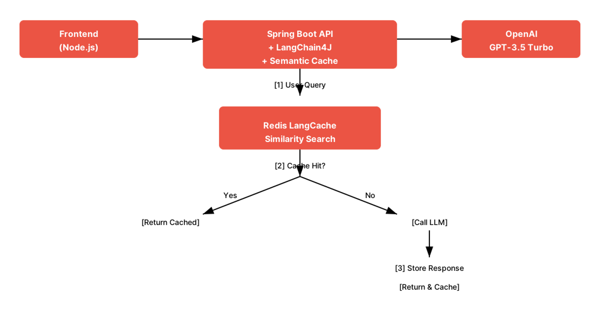
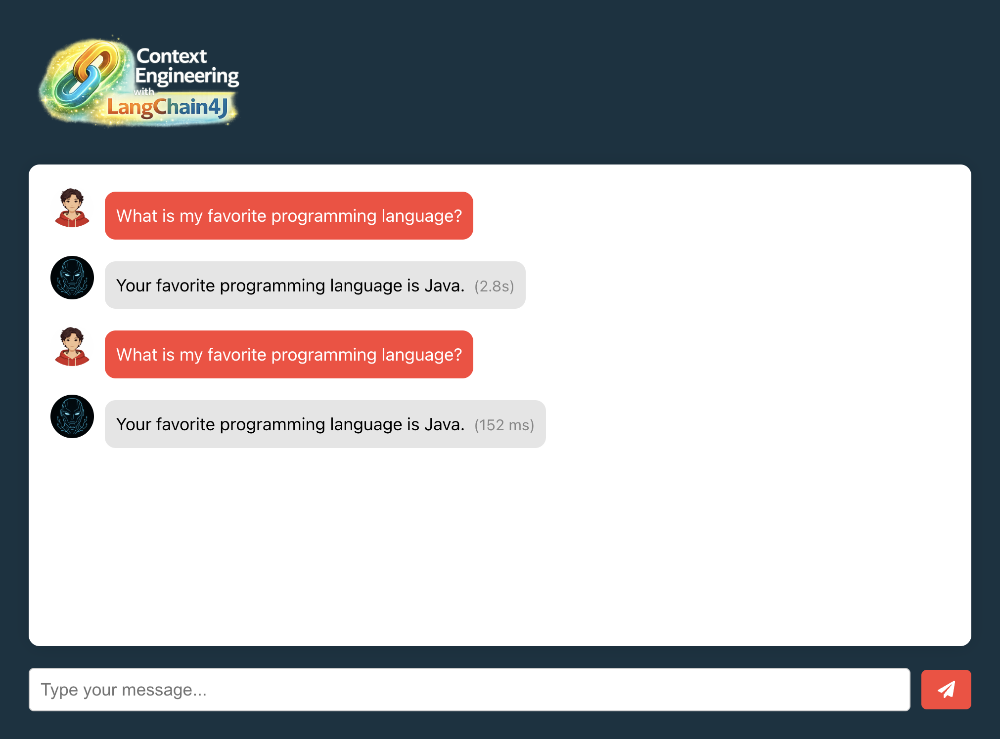
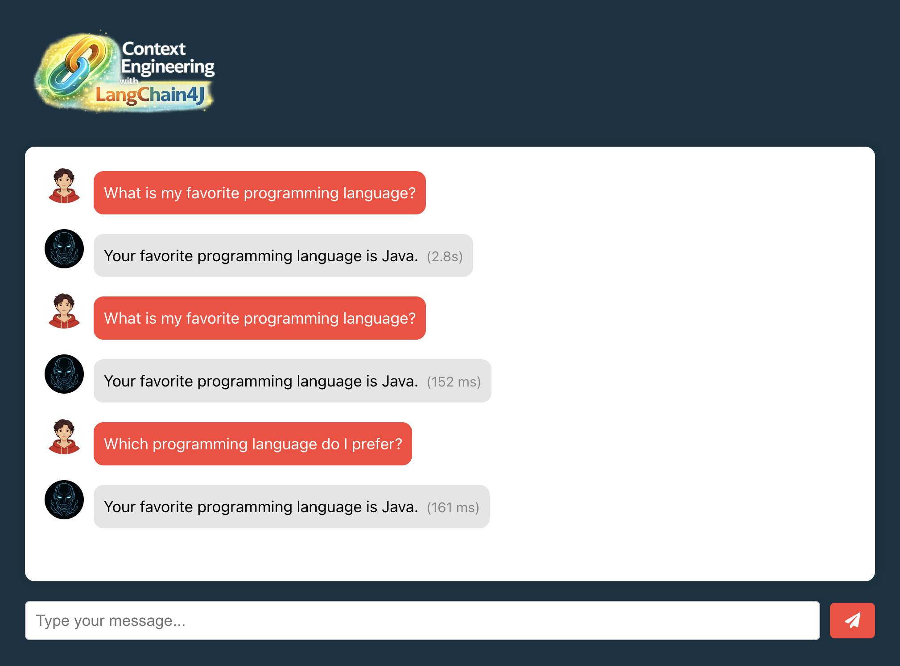
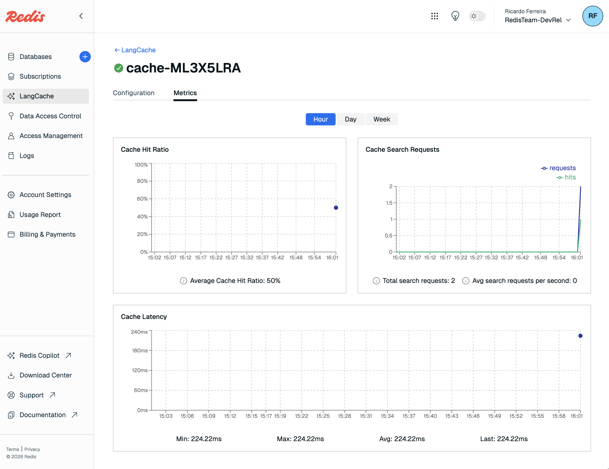

# Lab 9: Implementing Semantic Caching for Conversations

## 🎯 Learning Objectives

By the end of this lab, you will:
- Set up Redis LangCache for semantic caching of LLM responses
- Implement cache lookup before making LLM calls
- Store AI responses with semantic similarity matching
- Reduce costs and latency through intelligent caching
- Measure cache hit rates and performance improvements

#### 🕗 Estimated Time: 25 minutes

## 🏗️ What You're Building

In this final lab, you'll implement semantic caching to avoid redundant LLM calls when users ask similar questions, significantly reducing costs and improving response times. This includes:

- **Redis LangCache Integration**: Cloud-based semantic caching service
- **Similarity Matching**: Finding cached responses for similar queries
- **Cache Management**: TTL-based expiration and user isolation
- **Performance Optimization**: Instant responses for cached queries

### Architecture Overview



## 📋 Prerequisites Check

Before starting, ensure you have:

- [ ] Completed Lab 8 successfully
- [ ] Token management configured and working
- [ ] Redis Cloud account (free tier is sufficient)
- [ ] Understanding of semantic similarity concepts

## 🚀 Setup Instructions

### Step 1: Switch to the Lab 9 Branch

```bash
git checkout lab-9-starter
```

### Step 2: Review the LangCacheService

Open `backend-layer/src/main/java/io/redis/devrel/workshop/services/LangCacheService.java` and review the caching methods:

```java
public class LangCacheService {
    // Stores new responses in cache
    public void addNewResponse(String prompt, String response) {...}
    
    // Searches for similar cached responses
    public Optional<String> searchForResponse(String prompt) {...}
}
```

Key configuration values:
- **TTL**: 60 seconds (for testing, production would be higher)
- **Similarity Threshold**: 0.7 (70% similarity required for cache hit)

### Step 3: Create Redis LangCache Service

1. Go to [Redis Cloud Console](https://cloud.redis.io)
2. Navigate to the LangCache section in the left menu
3. Create a new service with `Quick service creation`
4. Note down:
   - **Base URL**
   - **API Key**
   - **Cache ID**

### Step 4: Configure LangCache Properties

Add to your `.env` file:

```bash
REDIS_LANGCACHE_SERVICE_BASEURL=your-redis-langcache-service-baseurl
REDIS_LANGCACHE_SERVICE_APIKEY=your-api-key-here
REDIS_LANGCACHE_SERVICE_CACHEID=your-cache-id-here
```

### Step 5: Implement Cache Check in ChatController

Open `backend-layer/src/main/java/io/redis/devrel/workshop/controller/ChatController.java` and update the `chat()` method.

Change from this:

```java
@GetMapping("/ai/chat/string")
public Flux<String> chat(@RequestParam("query") String query) {
    // TODO: Implement semantic caching with the LangCacheService
    return assistant.chat(SYSTEM_PROMPT, query);
}
```

To this:

```java
@GetMapping("/ai/chat/string")
public Flux<String> chat(@RequestParam("query") String query) {
    return langCacheService.searchForResponse(query)
            .map(Flux::just)
            .orElseGet(() -> assistant.chat(SYSTEM_PROMPT, query)
                    .collectList()
                    .map(responses -> String.join("", responses))
                    .doOnNext(response -> langCacheService.addNewResponse(query, response))
                    .flux()
            );
}
```

### Step 6: Rebuild and Run the Backend

```bash
cd backend-layer
mvn clean package
mvn spring-boot:run
```

### Step 7: Keep the Frontend Running

The frontend should still be running. If not:

```bash
cd frontend-layer
npm start
```

## 🧪 Testing Semantic Caching

### Test Cache Miss and Store

1. Open http://localhost:3000 in your browser
2. Ask a unique question: "What is my favorite programming language?"
3. Note the response time (first call hits LLM)


### Test Exact Match Cache Hit

1. Ask the exact same question: "What is my favorite programming language?"
2. Notice the instant response (now served from cache)



### Test Semantic Similarity

Test with similar but not identical queries:

**Original**: "What's my favorite programming language?"
**Variations to test**:
- "Which programming language do I prefer?"
- "Tell me my preferred coding language"
- "What language do I like to program in?"



Each should return cached response if similarity > 70%

### Test Cache Expiration

1. Ask a question and get a response
2. Wait 60+ seconds (TTL expiration)
3. Ask the same question again
4. Verify it hits the LLM again (cache expired)

### Monitor Cache Performance

Using the `Metrics` tab of your LangCache service, observe these metrics:
- **Cache Hit Ratio**: Cache hits vs total requests
- **Cache Search Requests**: Number of cache lookups
- **Cache Latency**: Time taken for cache searches



## 🎨 Understanding the Code

### 1. `LangCacheService`
- HTTP client for Redis LangCache API
- Semantic search using vector embeddings
- TTL-based automatic expiration

### 2. Cache Search Process
- Converts query to embedding
- Searches for similar cached prompts
- Returns response if similarity > threshold
- Falls back to LLM if no match

### 3. Cache Storage Process
- After LLM generates response
- Stores prompt-response pair
- Sets TTL for automatic cleanup

### 4. Similarity Threshold
- 0.7 (70%) - Good balance for testing
- Higher values = more exact matches required
- Lower values = more cache hits but less accuracy
- Production typically uses 0.8-0.9

## 🔍 Performance Impact

### Before Semantic Caching
- Every query hits OpenAI API
- ~2-3 seconds response time
- ~$0.002 per query cost
- No redundancy optimization

### After Semantic Caching
- Similar queries served from cache
- ~50ms response time for cache hits
- Zero cost for cached responses
- 40-60% typical cache hit rate

## 🐛 Troubleshooting

### Common Issues and Solutions

<details>
<summary>Cache always misses</summary>

Solution:
- Verify Redis LangCache credentials
- Check network connectivity to Redis Cloud
- Lower similarity threshold (try 0.6)
- Ensure cache ID is correct
- Check TTL hasn't expired
</details>

<details>
<summary>Wrong responses from cache</summary>

Solution:
- Increase similarity threshold (try 0.8 or 0.9)
- Clear cache and rebuild
- Verify user isolation is working
- Check cache entries in Redis Cloud console
</details>

<details>
<summary>Cache service connection errors</summary>

Solution:
- Verify API key and base URL
- Check Redis Cloud service status
- Review firewall/proxy settings
- Test with curl directly to API
</details>

## 🎉 Lab Completion

Congratulations! You've successfully:
- ✅ Implemented semantic caching with Redis LangCache
- ✅ Reduced redundant LLM calls
- ✅ Improved response times dramatically
- ✅ Added cost optimization through caching

## 🏆 Workshop Complete!

You've now built a complete context engineering solution with:
- ✅ **Short-term Memory** (Lab 2)
- ✅ **Knowledge Base** (Lab 3)
- ✅ **RAG Pipeline** (Lab 4)
- ✅ **Long-term Memory** (Lab 5)
- ✅ **Query Optimization** (Lab 6)
- ✅ **Context ReRanking** (Lab 6)
- ✅ **Few-shot Learning** (Lab 7)
- ✅ **Token Management** (Lab 8)
- ✅ **Semantic Caching** (Lab 9)

## 📚 Additional Resources

- [Redis LangCache Documentation](https://redis.io/docs/langcache/)
- [Semantic Caching Best Practices](https://redis.com/blog/semantic-caching-llm/)
- [Vector Similarity Search](https://redis.io/docs/stack/search/reference/vectors/)
- [LLM Cost Optimization](https://www.pinecone.io/learn/llm-cost-optimization/)

## 🚀 Next Steps

Consider these enhancements:
- Implement cache warming strategies
- Add cache analytics dashboard
- Experiment with different similarity thresholds
- Implement cache invalidation patterns
- Scale to production with Redis Enterprise

---

**Thank you for completing the Context Engineering Workshop!** 🎊