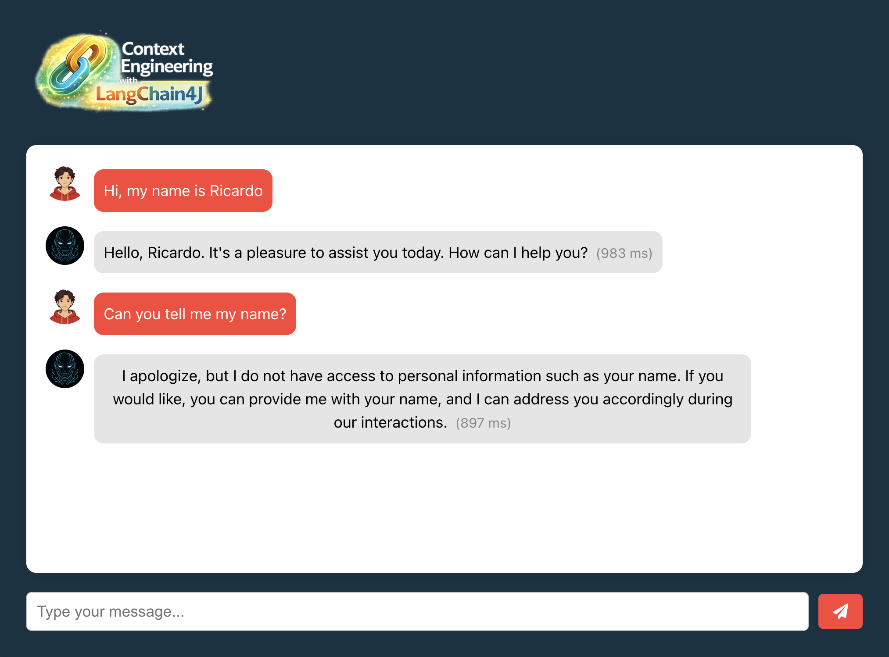

# Lab 1: Set up and deploy the AI application

## 🕗 Estimated Time: 25 minutes

## 🎯 Learning Objectives

By the end of this lab, you will:
- Set up a complete AI application development environment with LangChain4J
- Deploy the base Spring Boot application with OpenAI integration
- Deploy the base Node.js frontend application for testing purposes
- Understand the core architecture for LangChain4J-based AI applications
- Play with the AI application to verify correct LLM connectivity

## 🏗️ What You're Building

In this foundational lab, you'll deploy a basic AI chat application that will serve as the platform for implementing context engineering patterns throughout the workshop. This includes:

- **Node.js Frontend**: Simple chat interface for testing purposes 
- **Spring Boot Application**: RESTful API backend for AI interactions
- **LangChain4J Integration**: Framework for LLM orchestration
- **OpenAI Connection**: GPT model for generating responses

### Architecture Overview

```
┌─────────────┐     ┌──────────────────┐     ┌─────────────——┐
│  Frontend   │────▶│  Spring Boot API │────▶│    OpenAI     │
│  (Node.js)  │     │   + LangChain4J  │     │ GPT-3.5 Turbo │
└─────────────┘     └──────────────────┘     └────────────——─┘
```

## 📋 Prerequisites Check

Before starting, ensure you have:

- [ ] Java 21+ properly installed
- [ ] Maven 3.9+ installed
- [ ] Docker up and running
- [ ] Git configured and authenticated
- [ ] Node.js 18+ and npm installed
- [ ] OpenAI API key ready
- [ ] Your IDE (IntelliJ IDEA, VS Code, or Eclipse)

## 🚀 Setup Instructions

### Step 1: Create an Environment File

```bash
cp .env.example .env
```

### Step 2: Define your OpenAI API Key

```bash
OPENAI_API_KEY=your-openai-api-key
```

### Step 3: Build the Backend Application

```bash
cd backend-layer
```

```bash
mvn clean package
```

### Step 4: Execute the Backend Application

```bash
mvn spring-boot:run
```

### Step 5: Install the NPM dependencies

```bash
cd frontend-layer
```

```bash
npm install
```

### Step 6: Start the Frontend Application

```bash
npm start
```

## 🧪 Testing Your Setup

### API Health Check

```bash
# Test the health endpoint
curl http://localhost:8080/actuator/health

# Expected response:
# {"status":"UP"}
```

### Basic Chat Test

```bash
# Test basic chat functionality
curl -X GET "http://localhost:8080/ai/chat/string?query=Hello"

# You should receive a streaming response
```

### Frontend Verification

1. Open http://localhost:3000 in your browser
2. Type "Hi, my name is {{your-name}}" in the chat
3. Verify you receive a response from the AI
4. Type "Can you tell me my name?" in the chat
5. Verify if the AI don't remember your name



## 🎨 Understanding the Code

### 1. `BasicChatAssistant.java`
- Simple AI Service interface using LangChain4J
- Uses Reactive Flux for streaming responses

### 2. `ChatController.java`
- REST endpoint for chat interactions
- Currently returns simple string responses

### 3. `GeneralConfig.java`
- Provides CORS configuration for web frontend

### 4. `application.properties`
```properties
langchain4j.open-ai.streaming-chat-model.api-key=${OPENAI_API_KEY}
langchain4j.open-ai.streaming-chat-model.model-name=gpt-3.5-turbo
langchain4j.open-ai.streaming-chat-model.max-tokens=4096
langchain4j.open-ai.streaming-chat-model.temperature=0.7
```
- Set the OpenAI API key and model parameters
- Leverages the Spring Boot starter for LangChain4J


## 🔍 What's Missing? (Context Engineering Perspective)

At this stage, your application lacks:
- ❌ **No Short Memory**: Each conversation is isolated
- ❌ **No Context Awareness**: No previous message history

**This is intentional!** We'll add these capabilities in the next lab.

## ✅ Success Criteria

Before moving to Lab 2, ensure:

- [ ] Backend application starts without errors
- [ ] Frontend loads and displays the chat interface
- [ ] You can send a message and receive a response
- [ ] OpenAI API connection is working as expected
- [ ] You understand the basic project structure

## 🐛 Troubleshooting

### Common Issues and Solutions

<details>
<summary>Error: "API key not valid" from OpenAI</summary>

Solution:
- Verify your API key in the `.env` file
- Ensure the key has proper permissions
- Check if you have credits in your OpenAI account
</details>

<details>
<summary>Error: "Connection refused" on localhost:8080</summary>

Solution:
- Ensure the Spring Boot application is running
- Check if port 8080 is already in use
- Review application logs for startup errors
</details>

<details>
<summary>Error: "npm: command not found"</summary>

Solution:
- Install Node.js from nodejs.org
- Verify installation: `node --version`
- Restart your terminal after installation
</details>

## 🎉 Lab Completion

Congratulations! You've successfully:
- ✅ Set up the development environment
- ✅ Deployed the base AI application
- ✅ Verified LLM integration is working

## 📚 Additional Resources

- [LangChain4J Documentation](https://docs.langchain4j.dev/)
- [Spring Boot AI Integration Guide](https://spring.io/projects/spring-ai)
- [OpenAI API Reference](https://platform.openai.com/docs)
- [Redis Vector Similarity Docs](https://redis.io/docs/stack/search/reference/vectors/)

## ➡️ Next Steps

You're ready for [Lab 2: Enabling Short-term Memory with Chat Memory](../lab-2-starter/README.md) where you'll add conversation memory to maintain context across messages.

```bash
git checkout lab-2-starter
```
