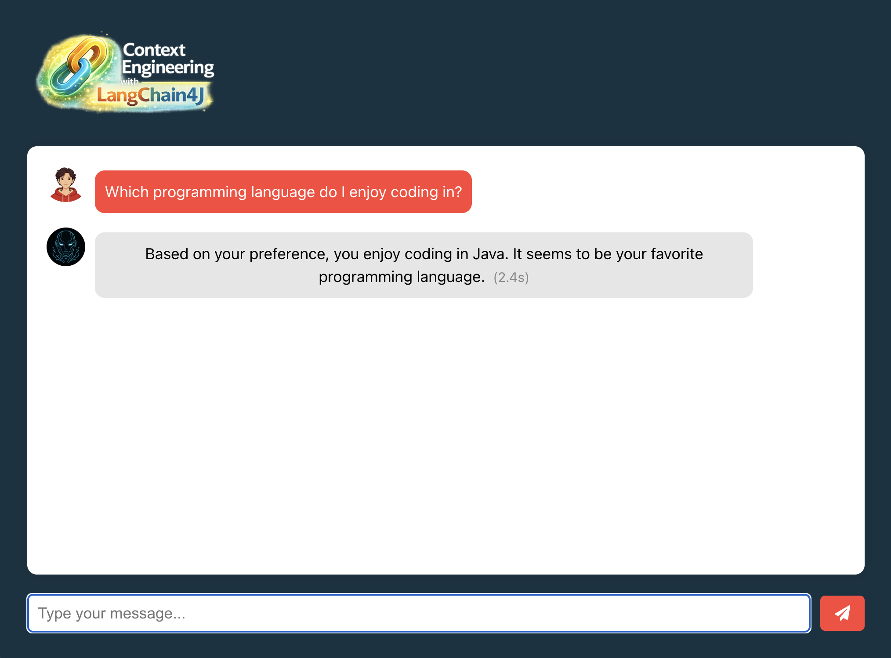
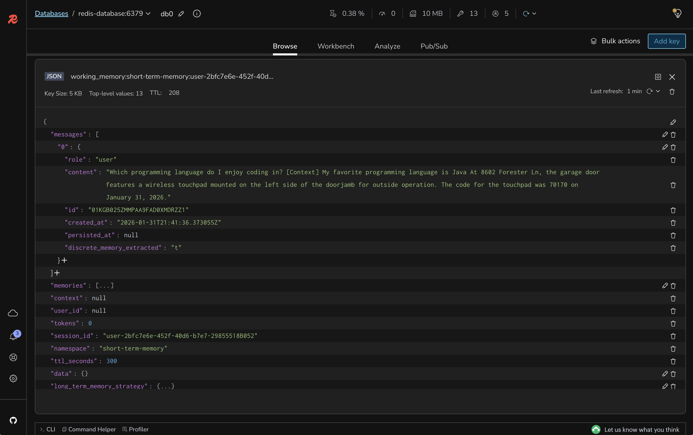

# Lab 5: Enabling On-demand Context Management for Memories

## 🎯 Learning Objectives

By the end of this lab, you will:
- Implement long-term memory storage for user-specific information
- Enable users to explicitly store personal preferences and facts
- Configure dual-layer memory with both short-term and long-term storage
- Integrate user memories with the RAG pipeline for personalized responses
- Test memory persistence across different chat sessions

#### 🕗 Estimated Time: 10 minutes

## 🏗️ What You're Building

In this lab, you'll add long-term memory capabilities that allow users to explicitly store personal information, preferences, and important facts that persist across sessions. This includes:

- **Long-term Memory Storage**: Persistent user-specific memories
- **Memory Management**: Ability to create and retrieve user memories
- **Dual-layer Architecture**: Combining short-term chat and long-term memories
- **Personalized RAG**: Integrating user memories with knowledge retrieval

### Architecture Overview

```
┌─────────────┐     ┌────────────────—──┐     ┌─────────────——┐
│  Frontend   │────▶│  Spring Boot API  │────▶│    OpenAI     │
│  (Node.js)  │     │   + LangChain4J   │     │ GPT-3.5 Turbo │
└─────────────┘     │   + Dual Memory   │     └────────────——─┘
                    └─────────────────—─┘
                             │
                    ┌────────┴──────────┐
                    ▼                   ▼
          ┌──────────────────┐  ┌──────────────────┐
          │  Short-term      │  │  Long-term       │
          │  Chat Memory     │  │  User Memory     │
          └──────────────────┘  └──────────────────┘
                    │                   │
                    └────────┬──────────┘
                             ▼
                  ┌───────────——————──────┐
                  │  Agent Memory Server  │
                  │    (Redis Database)   │
                  └───────────────——————──┘
```

## 📋 Prerequisites Check

Before starting, ensure you have:

- [ ] Completed Lab 4 successfully
- [ ] RAG pipeline working with knowledge base
- [ ] Redis Agent Memory Server running
- [ ] Basic chat memory functioning from Lab 2

## 🚀 Setup Instructions

### Step 1: Review the Memory Service

Open `backend-layer/src/main/java/io/redis/devrel/workshop/services/MemoryService.java` and review the method to search long-term memories.

```java
public List<String> searchUserMemories(String userId, String memory) {
    var searchRequest = Map.of(
            "session_id", Map.of("eq", userId),
            "namespace", Map.of("any",
                    List.of(SHORT_TERM_MEMORY_NAMESPACE,
                            LONG_TERM_MEMORY_NAMESPACE)),
            "text", memory,
            "limit", 5
    );

    return extractTexts(executeSearch(searchRequest));
}
```

### Step 2: Implement User Memory Retriever

Open `backend-layer/src/main/java/io/redis/devrel/workshop/memory/LongTermMemory.java` and implement the `getLongTermMemories()` method.

Change from this:

```java
private ContentRetriever getLongTermMemories(String userId) {
  // TODO: Implement a content retriever that fetches user-specific memories
    return null;
}
```

To this:

```java
private ContentRetriever getLongTermMemories(String userId) {
    return query -> memoryService.searchUserMemories(userId, query.text())
            .stream()
            .map(Content::from)
            .toList();
}
```

### Step 3: Update the Query Router for Dual Memory

In the `getRetrievalAugmentor()` method, update the query router to include both knowledge base and user memories.

Change from this:

```java
QueryRouter queryRouter = null;
```

To this:

```java
Map<ContentRetriever, String> retrieversToDesc = Map.of(
        getLongTermMemories(userId), "User specific memories like preferences, events, and interactions",
        getGeneralKnowledgeBase(), "General knowledge base with facts and data from documents"
);

QueryRouter queryRouter = LanguageModelQueryRouter.builder()
        .chatModel(chatModel)
        .retrieverToDescription(retrieversToDesc)
        .fallbackStrategy(LanguageModelQueryRouter.FallbackStrategy.ROUTE_TO_ALL)
        .build();
```

### Step 4: Add ChatModel Parameter

Update the `getRetrievalAugmentor()` method signature to accept a ChatModel:

```java
@Bean
public RetrievalAugmentor getRetrievalAugmentor(ChatModel chatModel) {
    // Existing implementation with updated query router
}
```

### Step 7: Rebuild and Run the Backend

```bash
cd backend-layer
mvn clean package
mvn spring-boot:run
```

### Step 8: Keep the Frontend Running

The frontend should still be running. If not:

```bash
cd frontend-layer
npm start
```

## 🧪 Testing Your Long-term Memory

### Store Personal Information

Use curl to store a new personal memory directyly into the Redis Agent Memory Server:

```bash
curl -X POST http://localhost:8000/v1/long-term-memory/ \
  -H "Content-Type: application/json" \
  -d '{
    "memories": [
      {
        "id": "id-123456789",
        "session_id": "user-2bfc7e6e-452f-40d6-b7e7-29855518B052",
        "text": "My favorite programming language is Java",
        "namespace": "long-term-memory",
        "memory_type": "semantic"
      }
    ]
  }'
```

Alternatively, you can use the sample HTTP request available in the `rest-api-calls` folder. There are examples for IDEs (IntelliJ and VS Code) and Postman.

### Test Memory Retrieval

1. Open http://localhost:3000 in your browser
2. Ask "Which programming language do I enjoy coding in?"
3. Verify the AI recalls "Java" from stored memory



One interesting aspect of this lab is how the short-term chat memory (from Lab 2) and the long-term user memory (from this lab) work together. But you may notice that now the context provided to the LLM may be filled with multiple memories. For instance:



The LLM will then receive multiple memories in the context, which may be beneficial for answering more complex questions. But sometimes it may lead to a larger context filled with irrelevant data. Don't worry, we will fix this in the next lab.

### Store Multiple Memories

Store various types of personal information:

```bash
# Store preference
curl -X POST http://localhost:8000/v1/long-term-memory/ \
  -H "Content-Type: application/json" \
  -d '{
    "memories": [
      {
        "id": "id-987654321",
        "session_id": "user-2bfc7e6e-452f-40d6-b7e7-29855518B052",
        "text": "I prefer black coffee with no milk or sugar",
        "namespace": "long-term-memory",
        "memory_type": "semantic"
      }
    ]
  }'

# Store personal fact
curl -X POST http://localhost:8000/v1/long-term-memory/ \
  -H "Content-Type: application/json" \
  -d '{
    "memories": [
      {
        "id": "id-112233445",
        "session_id": "user-2bfc7e6e-452f-40d6-b7e7-29855518B052",
        "text": "My birthday is on October 5th",
        "namespace": "long-term-memory",
        "memory_type": "semantic"
      }
    ]
  }'

# Store work information
curl -X POST http://localhost:8000/v1/long-term-memory/ \
  -H "Content-Type: application/json" \
  -d '{
    "memories": [
      {
        "id": "id-111222333",
        "session_id": "user-2bfc7e6e-452f-40d6-b7e7-29855518B052",
        "text": "I work as a software engineer at a startup",
        "namespace": "long-term-memory",
        "memory_type": "semantic"
      }
    ]
  }'
```

### Test Context Combination

Ask questions that require both memories and knowledge base:
- "Based on what you know about me, what coffee would you recommend?"
- "Given my interests, what information from the documents might be relevant?"

### Verify Memory Persistence

1. Stop and restart the backend application
2. Ask about previously stored information
3. Confirm memories persist across sessions

## 🎨 Understanding the Code

### 1. `MemoryService.searchUserMemories()`
- Searches user memories using semantic similarity
- Filters by user ID for privacy and isolation
- Returns relevant memories based on query
- Combines multiple memory types (preferences, facts, events)

### 2. `LanguageModelQueryRouter`
- Intelligently routes queries to appropriate retrievers
- Uses LLM to determine if query needs user memory or knowledge
- Falls back to searching all sources when uncertain
- Provides descriptions to help routing decisions

### 3. Dual-layer Memory Architecture
- Short-term: Recent conversation context (Lab 2)
- Long-term: Persistent user memories (this lab)
- Knowledge base: Document information (Lab 3-4)
- All layers work together for comprehensive context

## 🔍 What's Still Missing? (Context Engineering Perspective)

Your application now has dual-layer memory, but still lacks:
- ❌ **No Query Compression**: Queries aren't optimized
- ❌ **No Content Reranking**: Retrieved content isn't prioritized
- ❌ **No Few-shot Learning**: No examples in prompts
- ❌ **No Token Management**: No handling of context limits

**Next labs will add these optimization features!**

## 🐛 Troubleshooting

### Common Issues and Solutions

<details>
<summary>Memories not being stored</summary>

Solution:
- Check Redis Agent Memory Server is running
- Verify the POST request format is correct
- Check backend logs for storage errors
- Ensure memory text is not empty
</details>

<details>
<summary>AI doesn't recall stored memories</summary>

Solution:
- Verify memories exist in Redis using RedisInsight
- Check the userId matches between storage and retrieval
- Ensure query router is properly configured
- Test with more specific memory-related questions
</details>

<details>
<summary>Wrong retriever being used</summary>

Solution:
- Check LanguageModelQueryRouter configuration
- Verify retriever descriptions are clear
- Review fallback strategy settings
- Monitor logs to see routing decisions
</details>

## 🎉 Lab Completion

Congratulations! You've successfully:
- ✅ Implemented long-term user memory storage
- ✅ Enabled explicit memory management
- ✅ Integrated user memories with RAG pipeline
- ✅ Created a dual-layer memory architecture

## 📚 Additional Resources

- [LangChain4J Memory Types](https://docs.langchain4j.dev/tutorials/chat-memory)
- [Personal Knowledge Management](https://www.pinecone.io/learn/personal-ai-assistant/)
- [Query Routing Strategies](https://docs.langchain4j.dev/tutorials/rag#routing)
- [Memory System Design](https://redis.io/docs/stack/search/reference/vectors/)

## ➡️ Next Steps

You're ready for [Lab 6: Implementing Query Compression and Context Reranking](../lab-6-starter/README.md) where you'll optimize query processing and improve retrieval quality.

```bash
git checkout lab-6-starter
```