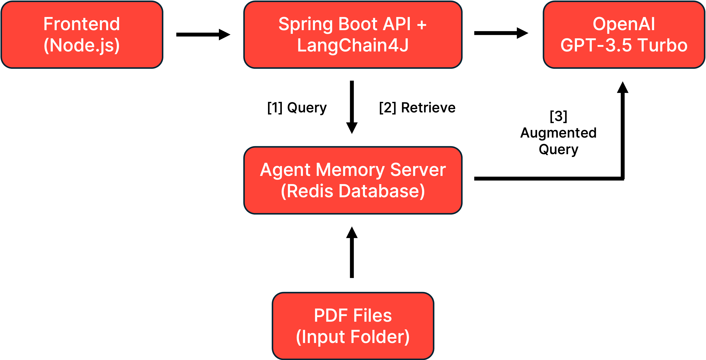
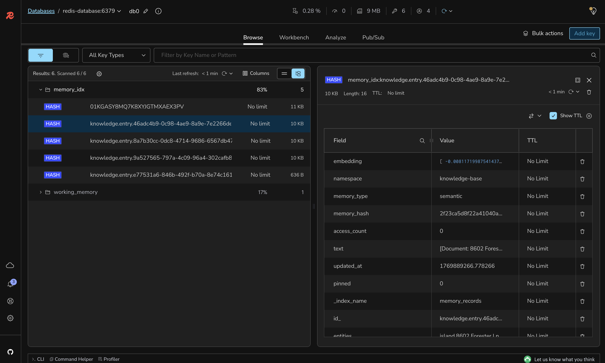
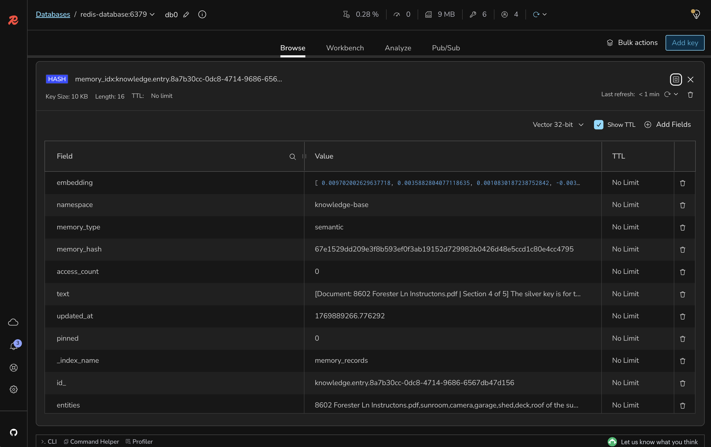

# Lab 3: Knowledge Base with Embeddings, Parsers, and Splitters

## 🎯 Learning Objectives

By the end of this lab, you will:
- Configure document parsing for PDF files using Apache PDFBox
- Implement document splitting strategies for optimal chunk sizes
- Create vector embeddings for semantic search capabilities
- Store processed documents in the Redis Agent Memory Server
- Understand how document processing enables knowledge-augmented AI

#### 🕗 Estimated Time: 10 minutes

## 🏗️ What You're Building

In this lab, you'll add document processing capabilities to your AI application, allowing it to ingest PDF documents and create a searchable knowledge base. This includes:

- **Document Parser**: Apache PDFBox for extracting text from PDFs
- **Document Splitter**: Paragraph-based splitting for optimal chunks
- **Embeddings Generation**: Converting text to vector representations
- **Knowledge Storage**: Persisting document chunks for semantic retrieval

### Architecture Overview



## 📋 Prerequisites Check

Before starting, ensure you have:

- [ ] Completed Lab 2 successfully
- [ ] Redis Agent Memory Server running (from Lab 2)
- [ ] Backend application configured with memory support
- [ ] Sample PDF documents ready for testing

## 🚀 Setup Instructions

### Step 1: Switch to the Lab 3 Branch

```bash
git checkout lab-3-starter
```

### Step 2: Configure the Knowledge Base Input Directory

Add to your `.env` file:

```bash
KNOWLEDGE_BASE_INPUT_FILES=/data/input-files
```

### Step 3: Add Sample PDF Documents

Place at least one or more PDF files in the `KNOWLEDGE_BASE_INPUT_FILES` directory. For testing, you can use any PDF document that has multiple pages and paragraphs.

### Step 4: Review the FilesProcessor Implementation

Open `backend-layer/src/main/java/io/redis/devrel/workshop/services/FilesProcessor.java` and review the document processing logic:

```java
@Service
public class FilesProcessor {
    // Automatic PDF scanning every 5 seconds
    @Scheduled(fixedRate = 5000)
    public void scanForPdfFiles() {
        // Scans for new PDF files
    }
}
```

As you can see, the `scanForPdfFiles()` method is scheduled to run every 5 seconds to check for new PDF files in the input directory. Once a file is detected, it calls the `processFile()` method to handle the document.

### Step 5: Implement the Document Processing

Open `backend-layer/src/main/java/io/redis/devrel/workshop/services/FilesProcessor.java` and implement the PDF file processing behavior. You won't need to implement everything, just the parts that are pending.

In the `processFile()` method, change from this:

```java
private void processFile(File file) {
    // TODO: Initialize these objects properly
    final DocumentParser documentParser = null;
    final DocumentSplitter documentSplitter = null;
```

To this:

```java
private void processFile(File file) {
    final DocumentParser documentParser = new ApachePdfBoxDocumentParser();
    final DocumentSplitter documentSplitter = new DocumentByParagraphSplitter(1000, 100);
```

In the `scanForPdfFiles()` method, change from this:

```java
@Scheduled(fixedRate = 5000)
public void scanForPdfFiles() {
    File dir = new File(knowledgeBaseInputFiles);
    if (dir.exists() && dir.isDirectory()) {
        File[] pdfFiles = dir.listFiles((d, name) -> name.toLowerCase().endsWith(".pdf"));
        if (pdfFiles != null) {
            for (File pdf : pdfFiles) {
                // TODO: Uncomment the line below to enable file processing
                // processFile(pdf);
            }
        }
    }
}
```

To this:

```java
@Scheduled(fixedRate = 5000)
public void scanForPdfFiles() {
    File dir = new File(knowledgeBaseInputFiles);
    if (dir.exists() && dir.isDirectory()) {
        File[] pdfFiles = dir.listFiles((d, name) -> name.toLowerCase().endsWith(".pdf"));
        if (pdfFiles != null) {
            for (File pdf : pdfFiles) {
                processFile(pdf);
            }
        }
    }
}
```

With these changes, your application is now set up to automatically detect and process PDF files placed in the specified input directory. The parser and the splitter implementations used here were provided by the LangChain4J framework.

### Step 6: Rebuild and Run the Backend

```bash
cd backend-layer
mvn clean package
mvn spring-boot:run
```

### Step 7: Monitor Document Processing

Watch the console logs to see your PDFs being processed:

```bash
INFO  FilesProcessor : Processing file /path/to/your-document.pdf
INFO  FilesProcessor : Processed your-document.pdf - 15 segments stored out of 18 total
```

## 🧪 Testing Your Knowledge Base

### Document Processing Verification

1. Place a PDF file in the `KNOWLEDGE_BASE_INPUT_FILES` directory
2. Wait 5-10 seconds for the scheduled scanner to detect it
3. Check the logs for processing confirmation
4. Verify the file is renamed to `.processed`

```bash
ls -la knowledge-base-input-files/
# You should see: your-document.processed
```

### Verify Knowledge Base Storage

Using RedisInsight (http://localhost:5540):

1. Connect to the Redis database
2. Look for keys with the pattern `knowledge.entry.*`
3. Inspect the stored document segments



### Test Document Chunks

Each chunk should contain:
- Document metadata (filename, section number)
- The actual text content from the created chunk
- An embedding field containing the vector data



### Processing Multiple Documents

1. Add 2-3 PDF files to the input directory
2. Monitor the logs to see batch processing
3. Verify all documents are processed and renamed
4. Check Redis for multiple knowledge entries

## 🎨 Understanding the Code

### 1. `ApachePdfBoxDocumentParser`
- Extracts text content from PDF files
- Preserves document structure and formatting
- Handles various PDF encodings and formats

### 2. `DocumentByParagraphSplitter`
- Splits documents into manageable chunks (1000 chars)
- Maintains 100-character overlap for context continuity
- Preserves paragraph boundaries when possible

### 3. `MemoryService.createKnowledgeBaseEntry()`
- Stores document chunks in dedicated namespace
- Creates vector embeddings for semantic search
- Mark the document as semantic data for retrieval

### 4. Automatic Processing
- Scheduled task runs every 5 seconds
- Processes new PDFs automatically
- Renames files to `.processed` to avoid reprocessing

## 🔍 What's Still Missing? (Context Engineering Perspective)

Your application now has a knowledge base, but still lacks:
- ❌ **No Retrieval**: Can't search or retrieve relevant documents
- ❌ **No RAG Integration**: Knowledge isn't used in responses
- ❌ **No Query Routing**: Can't determine when to use knowledge

**Next lab will implement RAG to use this knowledge!**

## 🐛 Troubleshooting

### Common Issues and Solutions

<details>
<summary>PDF files not being detected</summary>

Solution:
- Verify the `KNOWLEDGE_BASE_INPUT_FILES` path is correct
- Ensure PDF files have `.pdf` extension (lowercase)
- Check file permissions for read access
- Review logs for directory scanning errors
</details>

<details>
<summary>Document parsing fails</summary>

Solution:
- Ensure PDF is not corrupted or password-protected
- Check if PDF contains extractable text (not just images)
- Verify Apache PDFBox dependencies are properly included
- Try with a simpler PDF document first
</details>

<details>
<summary>Segments not being stored</summary>

Solution:
- Verify Redis Agent Memory Server is running
- Check network connectivity to Redis
- Ensure segments meet minimum length (50 characters)
- Review logs for storage errors
</details>

## 🎉 Lab Completion

Congratulations! You've successfully:
- ✅ Configured document parsing for PDFs
- ✅ Implemented intelligent document splitting
- ✅ Created a searchable knowledge base
- ✅ Stored document embeddings for semantic retrieval

## 📚 Additional Resources

- [LangChain4J Document Loaders](https://docs.langchain4j.dev/tutorials/rag/#document-loader)
- [Apache PDFBox Documentation](https://pdfbox.apache.org/)
- [Document Splitting Strategies](https://docs.langchain4j.dev/tutorials/rag/#document-splitter)
- [Vector Embeddings Explained](https://redis.io/glossary/vector-embeddings/)

## ➡️ Next Steps

You're ready for [Lab 4: Implementing Basic RAG with Knowledge Base Data](../lab-4-starter/README.md) where you'll integrate the knowledge base with your chat responses using Retrieval-Augmented Generation.
