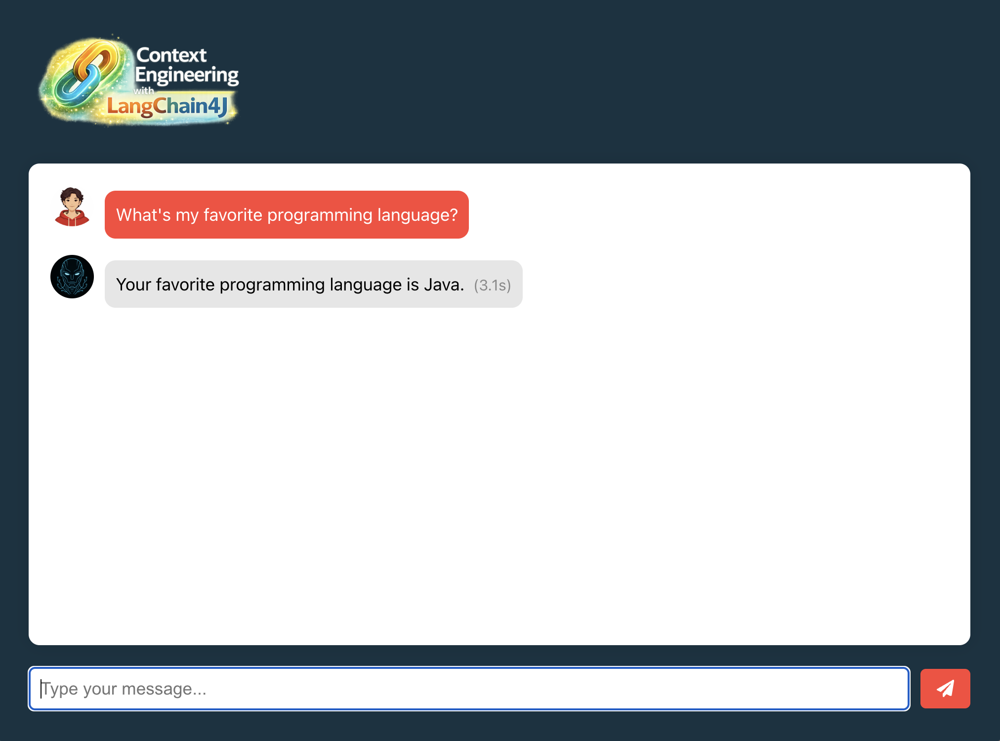
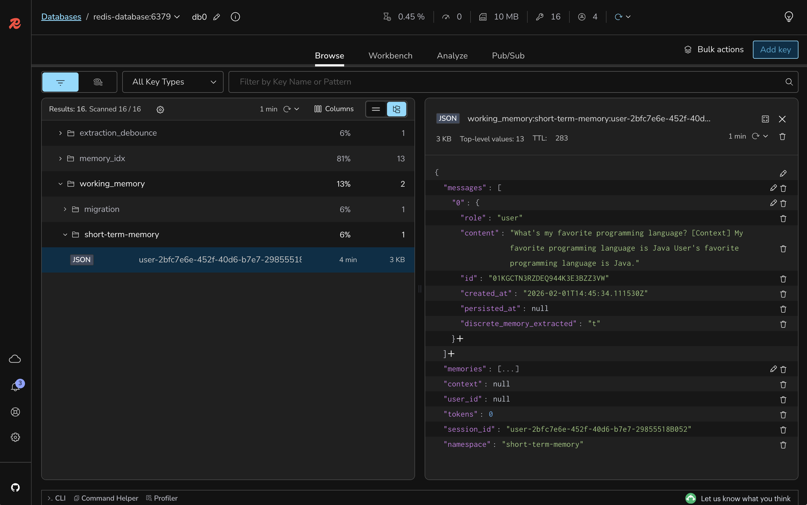

# Lab 7: Implementing Few-shot Learning in System Prompts

## 🎯 Learning Objectives

By the end of this lab, you will:
- Understand few-shot learning patterns for LLMs
- Implement example-based prompting in system messages
- Improve response consistency with structured examples
- Guide the AI's output format and style through demonstrations
- Test the impact of few-shot learning on response quality

#### 🕗 Estimated Time: 5 minutes

## 🏗️ What You're Building

In this lab, you'll enhance the system prompt with few-shot examples to guide the AI's responses more effectively. This includes:

- **Few-shot Examples**: Adding input-output pairs to demonstrate desired behavior
- **Format Consistency**: Ensuring responses follow a predictable structure
- **Context Handling**: Teaching the AI how to use retrieved context properly
- **Style Guidelines**: Establishing consistent tone and personality

### Architecture Overview


## 📋 Prerequisites Check

Before starting, ensure you have:

- [ ] Completed Lab 6 successfully
- [ ] Query compression and reranking working
- [ ] System prompt accessible in ChatController
- [ ] Test queries ready for comparison

## 🚀 Setup Instructions

### Step 1: Switch to the Lab 7 Branch

```bash
git checkout lab-7-starter
```

### Step 2: Review the Current System Prompt

Open `backend-layer/src/main/java/io/redis/devrel/workshop/controller/ChatController.java` and locate the `SYSTEM_PROMPT` constant:

```java
private static final String SYSTEM_PROMPT = """
            You are an AI assistant that should act, talk, and behave as if you were J.A.R.V.I.S AI
            from the Iron Man movies...
            """;
```

### Step 3: Add Few-shot Examples to the System Prompt

Replace the existing `SYSTEM_PROMPT` with an enhanced version that includes few-shot examples.

Change from the current prompt to:

```java
private static final String SYSTEM_PROMPT = """
            You are an AI assistant that should act, talk, and behave as if you were J.A.R.V.I.S AI
            from the Iron Man movies. Be formal but friendly, and add personality. You are going to
            be the brains behind this AI project. While providing answers, be informative but maintain
            the J.A.R.V.I.S personality.

            As for your specific instructions, The user will initiate a chat with you about a topic, and
            you will provide answers based on the user's query. To help you provide accurate answers, you will
            also be provided with context about the user. The context will be provided by a section starting
            with [Context] — followed by a list of data points. The data points will be structured in two sections:

            - Chat memory: everything the user has said so far during the conversation. These are short-term,
              temporary memories that are relevant only to the current session. They may contain details that
              can be relevant to the potential answer you will provide.

            - User memories: This will be a list of memories that the user asked to be stored, explicitely.
              They are long-term memories that persist across sessions. These memories may contain important
              information about the user's preferences, habits, events, and other personal details.

            IMPORTANT: You don't need to consider all data points while answering. Pick the ones that are
            relevant to the user's query and discard the rest. The context must be used to provide accurate
            answers. Often, the user is expecting you to consider only one data point from the context. Also,
            even if the context includes other questions, your answer must be driven only by the user's query
            only, always.

            Also, make sure to:

            1. Keep your answer concise with three sentences top. Avoid listing items and bullet points.
            2. Use gender-neutral language - avoid terms like 'sir' or 'madam'.
            3. When talking about dates, use the format Month Day, Year (e.g., January 1, 2020).

            Few-shot examples:

            [Example 1 - Using only relevant context]
            User: "What's my favorite color?"
            Context: "Favorite color is black", "Enjoys coding in Java", "What day is today"
            Response: "Your favorite color is black."

            [Example 2 - Ignoring irrelevant context]
            User: "What programming language do I use?"
            Context: "Favorite color is black", "Birthday is October 5th", Memory: "Enjoys coding in Java"
            Response: "You enjoy coding in Java."

            [Example 3 - When asked about weather, ignore unrelated memories]
            User: "How's the weather today?"
            Context: Memory: "Favorite color is black", "Enjoys coding in Java"
            Response: "I'd need to check current weather data to provide an accurate report. The memories available don't contain weather information."

            [Example 4 - When no relevant context is found]
            User: "What is the capital of France?"
            Context: "Enjoys coding in Java", Memory: "Favorite color is black"
            Response: "The capital of France is Paris. This is general knowledge not requiring personal context."

            [Example 5 - Combining multiple relevant memories]
            User: "Tell me about my work preferences"
            Context: "Works as software engineer", "Favorite language is Java", "Prefers remote work", "Birthday October 5th"
            Response: "You work as a software engineer with a preference for Java programming. You also prefer remote work arrangements."

            [Example 6 - Handling document knowledge]
            User: "What does the document say about garage door codes?"
            Context: Document: "The garage door code is 70170"
            Response: "According to the document, the garage door code is 70170."
            """;
```

### Step 4: Rebuild and Run the Backend

```bash
cd backend-layer
mvn clean package
mvn spring-boot:run
```

### Step 5: Keep the Frontend Running

The frontend should still be running. If not:

```bash
cd frontend-layer
npm start
```

## 🧪 Testing Few-shot Learning Impact

### Test Context Selection

1. Open http://localhost:3000 in your browser
2. Test with queries that have mixed relevant/irrelevant context
3. Verify the AI focuses only on relevant information

Example test:
- Ask: "What's my favorite programming language?"
- The response should mention only Java, ignoring other stored memories



As you can see, this is a very objective response. Even though the context created was this:



### Test Response Conciseness

1. Ask questions that previously generated long responses
2. Verify responses now stay within 3 sentences
3. Check that responses maintain clarity despite brevity

### Test Edge Cases

Test scenarios from the few-shot examples:
- Ask about information not in context (should acknowledge limitation)
- Ask about weather or current events (should explain lack of real-time data)
- Ask for multiple pieces of information (should combine relevant memories)

### Compare Before and After

Notice improvements in:
- **Consistency**: More predictable response format
- **Relevance**: Better focus on pertinent information
- **Brevity**: Shorter, more direct answers
- **Accuracy**: Improved context interpretation

## 🎨 Understanding the Code

### 1. Few-shot Learning Pattern
- Provides concrete examples of desired behavior
- Shows input-output pairs for different scenarios
- Teaches context selection through demonstration
- Establishes response format expectations

### 2. Example Categories
- **Relevant context usage**: Shows how to use available information
- **Irrelevant context filtering**: Demonstrates ignoring noise
- **Missing information handling**: How to acknowledge limitations
- **Multiple context combination**: Merging related information

### 3. Impact on AI Behavior
- More consistent response structure
- Better context discrimination
- Improved handling of edge cases
- Maintained personality while following guidelines

### 4. Prompt Engineering Best Practices
- Clear instructions before examples
- Diverse example scenarios
- Consistent format across examples
- Balance between guidance and flexibility

## 🔍 What's Still Missing? (Context Engineering Perspective)

Your application now has few-shot learning, but still lacks:
- ❌ **No Token Management**: No handling of context limits
- ❌ **No Semantic Caching**: Redundant queries still hit LLM

**Next labs will add these final optimizations!**

## 🐛 Troubleshooting

### Common Issues and Solutions

<details>
<summary>AI not following few-shot examples</summary>

Solution:
- Verify the system prompt is properly updated
- Check that examples are clear and consistent
- Ensure no conflicting instructions in the prompt
- Test with simpler queries first
</details>

<details>
<summary>Responses too rigid or robotic</summary>

Solution:
- Balance examples with personality instructions
- Don't over-constrain with too many examples
- Allow some flexibility in response format
- Maintain the J.A.R.V.I.S personality guidance
</details>

<details>
<summary>Context still being misused</summary>

Solution:
- Add more specific examples for your use case
- Make context labels clearer in examples
- Verify context is properly formatted
- Check RAG pipeline is working correctly
</details>

## 🎉 Lab Completion

Congratulations! You've successfully:
- ✅ Implemented few-shot learning in system prompts
- ✅ Added concrete examples for better guidance
- ✅ Improved response consistency and relevance
- ✅ Enhanced context selection accuracy

## 📚 Additional Resources

- [Few-shot Prompting Guide](https://www.promptingguide.ai/techniques/fewshot)
- [OpenAI Best Practices](https://platform.openai.com/docs/guides/prompt-engineering)
- [In-context Learning Research](https://arxiv.org/abs/2005.14165)

## ➡️ Next Steps

You're ready for [Lab 8: Enabling Token Management to Handle Token Limits](../lab-8-starter/README.md) where you'll implement dynamic context window management.

```bash
git checkout lab-8-starter
```